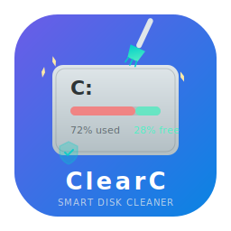

<p align="center">
  
</p>

<h1 align="center">ClearC</h1>

<p align="center">
  <strong>Smart C-Drive Cleaner for Windows</strong>
</p>

<p align="center">
  <a href="#english">English</a> | <a href="#中文">中文</a>
</p>

<p align="center">
  
  
  
  
  
  
</p>

---

<a id="english"></a>

## Overview

ClearC is an intelligent C-drive cleaning tool for Windows, built with **Tauri 2** (Rust backend + React frontend). It goes beyond simple disk cleanup by providing smart analysis, safety-first cleaning, and real-time monitoring capabilities.

## Key Features

### Smart Cleaning
- **One-Click Smart Clean** — Automatically scans and categorizes junk files into 3 risk levels (safe/warning/danger), with safe items pre-selected
- **System Junk Cleaner** — 8 categories: Windows temp files, Update cache, System logs, Thumbnail cache, Recycle bin, Error reports, Font cache, Delivery optimization
- **App Cache Cleaner** — 5 tabbed categories: Browser, Dev tools, Chat apps, Game platforms, Design tools, with trend tracking and growth alerts

### Deep Analysis
- **Big File Analyzer** — Configurable threshold, multi-sort/filter, orphan file detection with reason explanation
- **Duplicate File Detector** — 3 scan modes (Quick: size+name, Standard: size+partial hash, Exact: full SHA-256), auto-select with keep strategy
- **Storage Heatmap** — Treemap visualization + ring chart, directory drill-down, space change timeline
- **Smart Space Prediction** — Daily consumption rate, days-until-full prediction, Top 5 growth source ranking, threshold alerts

### Privacy & Safety
- **Privacy Trace Cleaner** — Browser/System/App traces, privacy score gauge (0-100), risk-level badges
- **Cleanup Impact Assessment** — Pre-clean risk evaluation, affected process detection, one-click close, auto-deselect high-risk items, alternative suggestions
- **Security Whitelist** — 35+ protected system directories, file extension protection, admin privilege detection, UAC elevation prompts

### Management & Automation
- **Startup Manager** — Enable/disable/delay startup items, safety rating, impact assessment, publisher info
- **Scheduled Cleanup** — Create cleanup schedules with frequency, module selection, and conditions
- **Rollback Center** — Full cleanup history, backup management, one-click restore, export backups
- **Rule Engine** — Custom cleanup rules with condition/action/priority, built-in templates, dry-run testing
- **Real-time Disk Monitor** — Live space change chart, write source tracking (process/PID/path/rate), notification center

### UX Innovation
- **First-time Onboarding** — 6-step interactive guide covering features, safety, and initial config
- **Help Center** — FAQ with search, troubleshooting guides, keyboard shortcuts, about page
- **Custom Title Bar** — Draggable region + minimize/maximize/close, close-to-tray behavior
- **System Tray** — Right-click menu (show/quick-scan/quit), double-click to restore, C-drive status tooltip
- **Dark/Light/System Theme** — Full theme support with CSS variables, persisted preference
- **Collapsible Sidebar** — 56px icon-only / 220px full, smooth transition

## Tech Stack

| Layer | Technology |
|-------|-----------|
| Desktop Framework | Tauri 2 (Rust + WebView) |
| Frontend | React 19 + TypeScript 5 + Vite 6 |
| Styling | TailwindCSS + CSS Custom Properties |
| State Management | Zustand with localStorage persistence |
| Icons | ByteDance IconPark (outline theme) |
| Database | SQLite via rusqlite |
| Backend | Rust (Windows API, SHA-2, ReadDirectoryChangesW) |
| CI/CD | GitHub Actions (x86_64 + aarch64) |

## Project Structure

```
ClearC/
├── .github/workflows/build.yml     # CI/CD pipeline
├── DESIGN.md                       # 9-section design system specification
├── docs/logo.svg                   # Project logo
├── src/                            # Frontend (React + TypeScript)
│   ├── App.tsx                     # Router with 17 module routes
│   ├── components/
│   │   ├── layout/                 # TitleBar, Sidebar, StatusBar
│   │   ├── common/                 # Button, Badge, StatsCard, ScanProgress,
│   │   │                           # CleanConfirm, CleanReport, FileList,
│   │   │                           # EmptyState, PermissionModal
│   │   └── modules/                # 17 feature modules
│   │       ├── SmartClean/         # M01: One-click smart clean
│   │       ├── SystemJunk/         # M02: System junk cleaner
│   │       ├── AppCache/           # M03: App cache cleaner
│   │       ├── BigFile/            # M04: Big file analyzer
│   │       ├── DuplicateFile/      # M05: Duplicate file detector
│   │       ├── StorageMap/         # M06: Storage heatmap
│   │       ├── PrivacyClean/       # M07: Privacy trace cleaner
│   │       ├── StartupManager/     # M08: Startup item manager
│   │       ├── UpdateClean/        # M09: System update cleaner
│   │       ├── SpacePredict/       # M10: Space prediction
│   │       ├── CleanImpact/        # M11: Cleanup impact assessment
│   │       ├── CleanSchedule/      # M12: Scheduled cleanup
│   │       ├── RollbackCenter/     # M13: Rollback center
│   │       ├── RuleEngine/         # M14: Rule engine
│   │       ├── DiskMonitor/        # M15: Real-time disk monitor
│   │       ├── Onboarding/         # M16: First-time guide
│   │       └── HelpCenter/         # M17: Help center
│   ├── hooks/                      # useScan, useClean, useIpc, useTauriEvent
│   ├── stores/                     # Zustand stores (configStore)
│   └── utils/                      # format, constants, security
├── src-tauri/                      # Backend (Rust)
│   ├── Cargo.toml                  # Rust dependencies
│   ├── tauri.conf.json             # Tauri configuration
│   └── src/
│       ├── lib.rs                  # App entry, tray, IPC registration
│       ├── commands/               # IPC command handlers
│       │   ├── scan.rs             # Scan commands
│       │   ├── clean.rs            # Clean commands
│       │   ├── monitor.rs          # Monitor commands
│       │   ├── backup.rs           # Backup commands
│       │   ├── rules.rs            # Rule commands
│       │   └── schedule.rs         # Schedule commands
│       ├── scanner/                # Scanner engine (6 modules)
│       ├── cleaner/                # Cleanup executor with backup
│       ├── monitor/                # File watcher + process tracker
│       ├── database/               # SQLite + 7 tables + migration
│       ├── rules/                  # Rule engine + templates
│       └── utils/                  # hash, path, privilege, whitelist
└── LICENSE                         # MIT License
```

## Getting Started

### Prerequisites

- **Node.js** 18+ and npm
- **Rust** 1.77+ (install via [rustup](https://rustup.rs/))
- **Visual Studio Build Tools** 2022 (with C++ desktop development workload)
- **Windows 10/11**

### Development

```bash
# Clone the repository
git clone https://github.com/vogadero/ClearC.git
cd ClearC

# Install frontend dependencies
npm install

# Start development server (frontend only, no Rust backend)
npm run dev

# Or start with Tauri (requires Rust toolchain)
npx tauri dev
```

### Build

```bash
# Build frontend only
npm run build

# Build Tauri application (requires Rust toolchain)
npx tauri build
```

### Without Rust Toolchain

If you don't have the Rust compilation environment set up locally, you can still develop the frontend:

```bash
npm install
npm run dev
```

The frontend runs with mock data and gracefully falls back when Tauri APIs are unavailable. The Rust backend will be compiled via GitHub Actions CI.

## Design System

ClearC follows a structured design system documented in `DESIGN.md` with 9 sections:

1. **Visual Theme** — Light/dark mode, canvas/surface/elevated layer system
2. **Color Palette** — 8 semantic color groups with subtle variants
3. **Typography** — 8-level type scale (display → caption)
4. **Components** — Button, Badge, StatsCard, ScanProgress, etc.
5. **Layout** — TitleBar(36px) + Sidebar(56/220px) + Content + StatusBar(28px)
6. **Depth** — 3-level elevation system
7. **Do's & Don'ts** — UI conventions and anti-patterns
8. **Responsive** — Compact/default/wide breakpoints
9. **Agent Prompt Guide** — For AI-assisted UI generation

## Innovation Highlights

| Feature | Innovation |
|---------|-----------|
| Cleanup Impact Assessment | Pre-clean risk analysis with process detection and auto-deselect |
| Smart Space Prediction | ML-ready space consumption forecast with growth source ranking |
| Storage Heatmap | Treemap + ring chart visualization with directory drill-down |
| Real-time Disk Monitor | ReadDirectoryChangesW-based write source tracking |
| Rule Engine | Custom rules with dry-run, priority system, and templates |
| Rollback Center | Full cleanup history with one-click backup restore |

## Contributing

1. Fork the repository
2. Create your feature branch (`git checkout -b feature/amazing-feature`)
3. Commit your changes (`git commit -m 'Add amazing feature'`)
4. Push to the branch (`git push origin feature/amazing-feature`)
5. Open a Pull Request

## License

This project is licensed under the MIT License — see the [LICENSE](LICENSE) file for details.

## Acknowledgments

- [Tauri](https://tauri.app/) — Desktop application framework
- [IconPark](https://iconpark.oceanengine.com/) — ByteDance open-source icon library
- [React](https://react.dev/) — UI library
- [TailwindCSS](https://tailwindcss.com/) — Utility-first CSS framework

---

<a id="中文"></a>

## 项目简介

ClearC 是一款基于 **Tauri 2**（Rust 后端 + React 前端）构建的 Windows C 盘智能清理工具。它超越简单的磁盘清理，提供智能分析、安全优先的清理策略和实时监控能力。

## 核心功能

### 智能清理
- **一键智能清理** — 自动扫描并将垃圾文件分为3个风险等级（安全/警告/危险），安全项默认勾选
- **系统垃圾清理** — 8大类别：Windows临时文件、更新缓存、系统日志、缩略图缓存、回收站、错误报告、字体缓存、传递优化
- **应用缓存清理** — 5个分类标签页：浏览器、开发工具、聊天应用、游戏平台、设计工具，支持趋势追踪和增长预警

### 深度分析
- **大文件分析器** — 可配置阈值、多维排序/筛选、孤立文件检测及原因说明
- **重复文件检测** — 3种扫描模式（快速：大小+文件名、标准：大小+头尾哈希、精确：全文件SHA-256），智能保留策略
- **存储热力图** — 矩形树图 + 环形图可视化，目录层级下钻，空间变化时间线
- **智能空间预测** — 每日消耗速率、预计耗尽天数、Top 5增长源排名、阈值预警

### 隐私与安全
- **隐私痕迹清理** — 浏览器/系统/应用隐私痕迹，隐私评分仪表盘（0-100），风险等级标签
- **清理影响评估** — 清理前风险评估，占用进程检测，一键关闭关联应用，自动取消高风险项，替代方案推荐
- **安全白名单** — 35+受保护系统目录，文件扩展名保护，管理员权限检测，UAC提权提示

### 管理与自动化
- **启动项管理** — 启用/禁用/延迟启动项，安全评级，影响评估，发布者信息
- **定时清理计划** — 创建清理计划，设置频率、模块选择和条件
- **清理回滚中心** — 完整清理历史，备份管理，一键恢复，导出备份
- **存储规则引擎** — 自定义清理规则（条件/动作/优先级），内置模板，干运行测试
- **实时磁盘监控** — 实时空间变化曲线，写入源追踪（进程/PID/路径/速率），通知中心

### 用户体验创新
- **首次使用引导** — 6步交互式引导，涵盖功能介绍、安全承诺、初始配置
- **帮助中心** — FAQ搜索、问题排查指南、快捷键说明、关于页面
- **自定义标题栏** — 拖拽区域 + 最小化/最大化/关闭，关闭时最小化到托盘
- **系统托盘** — 右键菜单（显示/快速扫描/退出），双击恢复窗口，C盘状态提示
- **深色/浅色/跟随系统主题** — 完整主题支持，CSS变量驱动，偏好持久化
- **可折叠侧边栏** — 56px仅图标 / 220px完整模式，平滑过渡动画

## 技术栈

| 层级 | 技术 |
|------|------|
| 桌面框架 | Tauri 2（Rust + WebView） |
| 前端 | React 19 + TypeScript 5 + Vite 6 |
| 样式 | TailwindCSS + CSS 自定义属性 |
| 状态管理 | Zustand + localStorage 持久化 |
| 图标 | 字节跳动 IconPark（outline 主题） |
| 数据库 | SQLite（rusqlite） |
| 后端 | Rust（Windows API、SHA-2、ReadDirectoryChangesW） |
| CI/CD | GitHub Actions（x86_64 + aarch64） |

## 快速开始

### 环境要求

- **Node.js** 18+ 及 npm
- **Rust** 1.77+（通过 [rustup](https://rustup.rs/) 安装）
- **Visual Studio Build Tools** 2022（C++ 桌面开发工作负载）
- **Windows 10/11**

### 开发

```bash
# 克隆仓库
git clone https://github.com/vogadero/ClearC.git
cd ClearC

# 安装前端依赖
npm install

# 启动开发服务器（仅前端，无 Rust 后端）
npm run dev

# 或使用 Tauri 启动（需要 Rust 工具链）
npx tauri dev
```

### 构建

```bash
# 仅构建前端
npm run build

# 构建 Tauri 应用（需要 Rust 工具链）
npx tauri build
```

### 无 Rust 工具链开发

如果本地没有配置 Rust 编译环境，仍然可以进行前端开发：

```bash
npm install
npm run dev
```

前端使用模拟数据运行，在 Tauri API 不可用时优雅降级。Rust 后端将通过 GitHub Actions CI 编译。

## 设计系统

ClearC 遵循 `DESIGN.md` 中文档化的结构化设计系统，包含9个章节：

1. **视觉主题** — 浅色/深色模式，canvas/surface/elevated 层级系统
2. **色板** — 8个语义色彩组及 subtle 变体
3. **字体排版** — 8级字号体系（display → caption）
4. **组件** — Button、Badge、StatsCard、ScanProgress 等
5. **布局** — TitleBar(36px) + Sidebar(56/220px) + Content + StatusBar(28px)
6. **层级** — 3级阴影系统
7. **规范与禁忌** — UI 约定和反模式
8. **响应式** — compact/default/wide 断点
9. **Agent 提示指南** — 用于 AI 辅助 UI 生成

## 创新亮点

| 功能 | 创新点 |
|------|--------|
| 清理影响评估 | 清理前风险分析 + 进程检测 + 自动取消高风险项 |
| 智能空间预测 | ML-ready 空间消耗预测 + 增长源排名 |
| 存储热力图 | 矩形树图 + 环形图可视化 + 目录下钻 |
| 实时磁盘监控 | 基于 ReadDirectoryChangesW 的写入源追踪 |
| 规则引擎 | 自定义规则 + 干运行 + 优先级系统 + 模板库 |
| 回滚中心 | 完整清理历史 + 一键备份恢复 |

## 参与贡献

1. Fork 本仓库
2. 创建功能分支 (`git checkout -b feature/amazing-feature`)
3. 提交更改 (`git commit -m 'Add amazing feature'`)
4. 推送到分支 (`git push origin feature/amazing-feature`)
5. 发起 Pull Request

## 开源许可

本项目基于 MIT 许可证开源 — 详见 [LICENSE](LICENSE) 文件。

## 致谢

- [Tauri](https://tauri.app/) — 桌面应用框架
- [IconPark](https://iconpark.oceanengine.com/) — 字节跳动开源图标库
- [React](https://react.dev/) — UI 库
- [TailwindCSS](https://tailwindcss.com/) — 实用优先 CSS 框架
